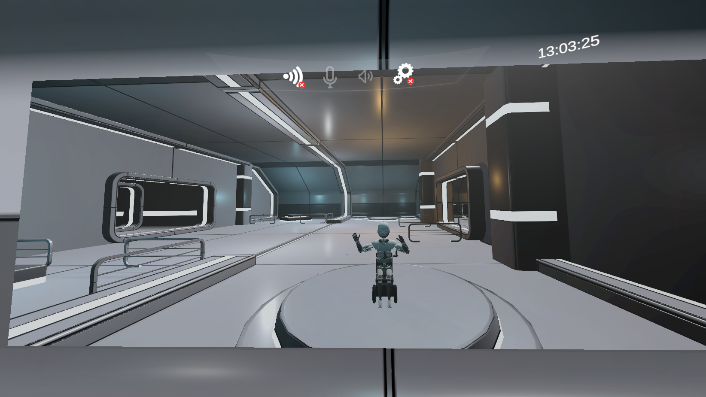
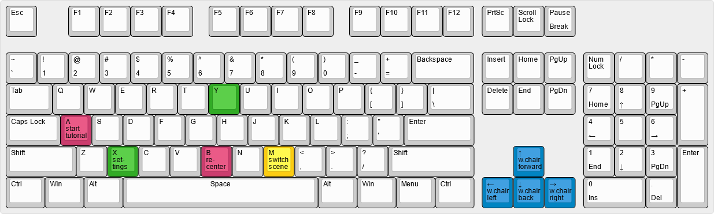

# TeleportVR

TeleportVR is a virtual reality environment to control Roboy.

## How to install

1. Clone or download the main branch of this repository
2. Open the project with Unity (tested with 2020.3.41f1)
3. Add the required UnityPackages from the [Google Drive Folder](https://drive.google.com/drive/folders/1b-Ez4EaQvI0c8lEPN2esZWvLFtbvm95R) to the project. 
Not all of the plugins are needed, look at the Section [Plugins](#plugins) for more information.
4. Set up the server to connect to Roboy. Follow the instructions in the Section [Server](#server).
5. Open the scene Scenes/main
6. You should now be able to start and use the application!

## Server
There are multiple possible channels how to connect to Roboy. Choose which one to use and follow the instructions.
The preconfigured GameObjects are in Prefabs/Server, just add the chosen one to the scene and set up the configuration.

### Animus
1. Add the Animus SDK to the project (>= Version 2.3.2, newer versions might fix some bugs but might not be compatible) from https://animus.cyberanimus.com/login.
Make sure to uncheck `UnityAnimusClient.cs` and `ClientLogic.cs` in the import process.
2. In the Unity Project, add `ANIMUS_USE_OPENCV` to the Scripting Define Symbols in the Project settings
3. Add your credentials in the Script `AnimusPasswordStore.cs`
4. Enter your Robot name in the Editor by clicking on the GameObject ClientLogic in the Hierarchy window and set the name in the field 'Robot Name'
5. In the script AnimusUtilities.cs, insert the line `UnityAnimusClient.DisplayLatency(AverageLag, AverageFps);` in line 233

### WebRTC
1. Add the Aiortc GameObject to the scene.
2. In AiortcConnector, set the URL of your server.

## Plugins

All used plugins are in the Google Drive folder linked above. Make sure to use plugins you need, and not use plugins you don't need as this might cause errors.

### CreepyCat - Showroom
Contains the sci-fi building from the Training scene.

### BioIK
Solves inverse kinematics problem. 

### Chart And Graph
Data visualization, some widgets might need it.

### Curved UI
Allows to bend canvases to create curved UI panels in VR, and handles interaction with it.

### MilkyWay
Provides a MilkyWay background (skybox) used in the Training scene.

### OpenCV
Used by Animus. Also for testing face recognition but that is too slow to do in Unity.

### Rewired
Used to connect rudder pedals.
To use the rudder pedals with presence detection, connect both the pedals and the Arduino via USB to the host PC. Then follow these steps:
1. Make sure the unity package `Rewired` from the Google Drive Folder is installed.
1. Set the scripting define symbol `RUDDER` in the player settings.
2. Determine the Arduino's assigned serial port.
   This can be done on Windows by running Device Manager where the Arduino 101 should show up under `Ports (COM & LPT)`

   

   In the above example the correct serial port would be `COM6`.
4.  Enter the correct serial port in the `GameObject` in `Managers/PresenceDetector` in the `Main` scene.
5.  Pause the game by taking any of your feet off the pedals.
	(Known Issue: The game is only paused if both feet were one the pedals at some point in time before pausing.)

### RosSharp
Allows to use Ros in C#. It works on Windows and can work on Android. 
However, as it is using some dll's Animus is also using with different versions, the android app crashes 
when having Animus, Rossharp and Unity XR in the project.
RosSharp is currently used for the Interface to the cage, and is thus needed if the cage is used.
If the cage is not used, RosSharp can be removed, so that the App can run on android.

### Sci-fi Buttons and Panels
Used to style the Settings panel.

### SenseGlove
If you want to use SenseGlove hand controllers to individually control each of Roboy's fingers, you need to: 
- Set the Scripting Define Symbol `SENSEGLOVE` in the player settings.
- Import all files from the package and start the Training scene. 
If the SenseGloves were detected correctly on your system, you'll be able to control Roboy's fingers.

## How to run in Unity Editor
Open the `Main.unity` scene in Unity Editor and press play.

## Build Instructions
The App can be run on a computer without VR, with a PC VR headset (tested with the Quest) in the Editor or in a build. Furthermore, it can run (without RosSharp) standalone on the Oculus Quest. To build it, select the plattform you want to use in the BuildSettings, select the scenes you want to have in the build. With the default settings, the scenes Main, HUD and Training are required (in this order).

For non-Quest headsets or the VR Mock, it might be needed to change the XR-Plugin Management in the Project Settings.

## How to use

- Use the Tutorial that explains how to use the app: press "A" (left primary button) on your controller to start.
- In case you don't have a VR headset, some keyboard shortcuts are provided (make sure KeyboardInputSystem is somewhere in you scene). The buttons correspond to the buttons on the VR controllers (right: A, B; left: X, Y; left menu button M).

([Permalink](http://www.keyboard-layout-editor.com/##@@=Esc&_x:1%3B&=F1&=F2&=F3&=F4&_x:0.5%3B&=F5&=F6&=F7&=F8&_x:0.5%3B&=F9&=F10&=F11&=F12&_x:0.25%3B&=PrtSc&=Scroll%20Lock&=Pause%0ABreak%3B&@_y:0.5%3B&=~%0A%60&=!%0A1&=%2F@%0A2&=%23%0A3&=$%0A4&=%25%0A5&=%5E%0A6&=%2F&%0A7&=*%0A8&=(%0A9&=)%0A0&=%2F_%0A-&=+%0A%2F=&_w:2%3B&=Backspace&_x:0.25%3B&=Insert&=Home&=PgUp&_x:0.25%3B&=Num%20Lock&=%2F%2F&=*&=-%3B&@_w:1.5%3B&=Tab&=Q&=W&=E&=R&=T&_c=%2332ab26%3B&=Y&_c=%23cccccc%3B&=U&=I&=O&=P&=%7B%0A%5B&=%7D%0A%5D&_w:1.5%3B&=%7C%0A%5C&_x:0.25%3B&=Delete&=End&=PgDn&_x:0.25%3B&=7%0AHome&=8%0A%E2%86%91&=9%0APgUp&_h:2%3B&=+%3B&@_w:1.75%3B&=Caps%20Lock&_c=%23cb3d6e%3B&=A%0Atutorial%0A%0A%0A%0A%0Astart&_c=%23cccccc%3B&=S&=D&=F&=G&=H&=J&=K&=L&=%2F:%0A%2F%3B&=%22%0A'&_w:2.25%3B&=Enter&_x:3.5%3B&=4%0A%E2%86%90&=5&=6%0A%E2%86%92%3B&@_w:2.25%3B&=Shift&=Z&_c=%2332ab26%3B&=X%0Atings%0A%0A%0A%0A%0Aset-&_c=%23cccccc%3B&=C&=V&_c=%23cb3d6e%3B&=B%0Acenter%0A%0A%0A%0A%0Are-&_c=%23cccccc%3B&=N&_c=%23fccc12%3B&=M%0Ascene%0A%0A%0A%0A%0Aswitch&_c=%23cccccc%3B&=%3C%0A,&=%3E%0A.&=%3F%0A%2F%2F&_w:2.75%3B&=Shift&_x:1.25&c=%230084c2%3B&=%E2%86%91%0Aforward%0A%0A%0A%0A%0Aw.chair&_x:1.25&c=%23cccccc%3B&=1%0AEnd&=2%0A%E2%86%93&=3%0APgDn&_h:2%3B&=Enter%3B&@_w:1.25%3B&=Ctrl&_w:1.25%3B&=Win&_w:1.25%3B&=Alt&_a:5&w:6.25%3B&=Space&_a:4&w:1.25%3B&=Alt&_w:1.25%3B&=Win&_w:1.25%3B&=Menu&_w:1.25%3B&=Ctrl&_x:0.25&c=%230084c2%3B&=%E2%86%90%0Aleft%0A%0A%0A%0A%0Aw.chair&=%E2%86%93%0Aback%0A%0A%0A%0A%0Aw.chair&=%E2%86%92%0Aright%0A%0A%0A%0A%0Aw.chair&_x:0.25&c=%23cccccc&w:2%3B&=0%0AIns&=.%0ADel))

## Known Problems
* The animus connection is often not working. There are many problems from animus, that can crash or freeze the application. Furthermore, some modalities are sometimes not opening. Try restarting the App, Unity, your computer, the animus server or the pybullet simulation on the server computer.
* Runnning Animus, Unity XR Interaction and Rossharp on android crashes the app after a few seconds, most likely because animus and rossharp need different versions of the same dll's.
* If Unity gives a lot of compile errors that say UnityEngine.UI or similar is unknown, try to reimport the Package UnityUI. If it persists, try restarting your coomputer and look if the file Packages/UnityUI/Editor/UnityEditor.UI is showing errors in the editor.
* I think Mouse Input for the laser is currently not working in the editor. This might be because some settings are not correctly set.
* When using the app with Oculus Link, you might disconnect often. This might be caused by a bad cable.
* When using Oculus Link, Unity might show a black screen, flimmer, or not start. Try restarting the app, Unity or your PC.
* If the app seems to be frozen / stuck on the loading screen while running from Unity, check if the game is not paused due to checked "ErrorPause" in the editor.
* Oculus Link sometimes does not allow to reset the view. Neiither restarting the Quest nor my Laptop did help here, but after some time it usually works again.
* A ROS message is not received by either side: ROS messages should not contain Timestamps or Durations, as these Ros Types are not supported for RosSharp and ROS 2
* When entering the HUD through the portal it is currently only possible to get back into the training by simulataneously pushing the left joystick back in the HUD and pressing the system menu, as the operator respawns in the same location where he left the Training. When leaving through the portal this means he’s still in the portal and thus get’s directly back into the HUD, if he isn’t moving backwards.
* When importing Animus, it is easy reimport the UnityAnimusClient.cs and ClientLogic.cs script. This will delete the current versions of the files and replace them with the animus versions. To get back to the version of the latest git commit, you can reset the changes to these scripts in git.
